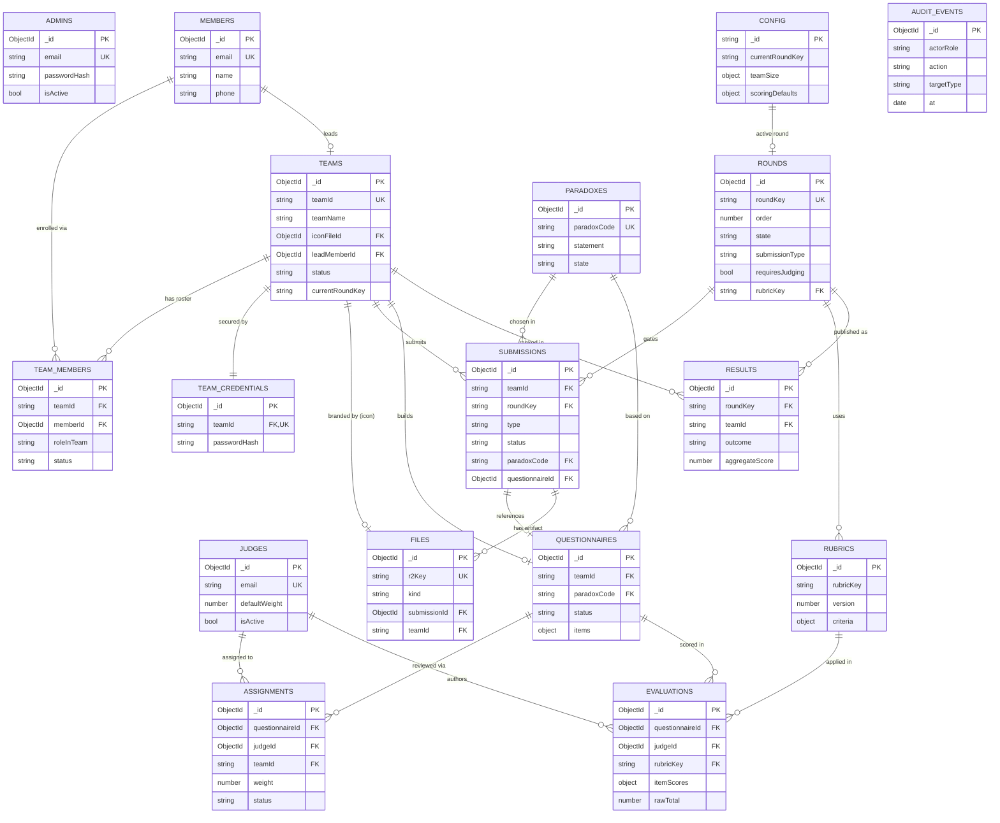

# Probably Paradoxical — Database Design

> **Status:** Draft for review · **Last updated:** 2026-06-04 · **Store:** MongoDB (Atlas) · **Blob storage:** Cloudflare R2
>
> This document describes the full data model for the competition platform. It is a clean, from-scratch design — it is **not** constrained by the collections currently present in the repo (`admins` / `users` / `passwords`). Those will be superseded by the design below. No implementation here; once approved we draft the `COLLECTIONS`, JSON-schema validators, and indexes.

---

## 1. What the platform does

A college competition run in gated stages. The host releases **paradox statements**; **teams** (2–5 members) pick one, define a real-world **theme** and a campus **target population**, then build a **questionnaire**. **External judges** score the questionnaires from a separate portal. The host gates each stage by publishing results, after which teams submit **datasets** and finally a **proctored analysis artifact** (zip).

### Stage pipeline

| # | `roundKey` | Team does | Platform records | Gate |
|---|------------|-----------|------------------|------|
| 0 | `inauguration` | — (watch online inauguration) | Host publishes paradoxes | — |
| 1 | `stage1_submission` | Pick paradox + theme + target population, build questionnaire | `submissions` (theme) + `questionnaires` (items) | Submission window closes |
| — | `stage1_selection` | — | Judges score → host accepts/rejects → publishes results | Advancement decided |
| 2 | `data_collection` | Collect data on campus, upload datasets | `submissions` (dataset) + `files` (csv/xlsx) | Host publishes results |
| 3 | `analysis` | Upload analysis artifact (zip) | `submissions` (analysis) + `files` (zip) | Final results |

Physical proctoring of the analysis round is handled **off-platform** — there is no proctoring/session entity.

---

## 2. Roles & authentication

| Role | Portal | Credential | JWT `role` |
|------|--------|-----------|------------|
| **Host / Organizer** | Admin portal | individual email + password | `admin` |
| **Team** (2–5 members) | Team portal | any **member** email + **shared team password** | `team` |
| **External Judge** | Judge portal | individual email + password | `judge` |

- `admins` and `judges` carry their own password digest inline.
- **Members are normalized** into their own `members` collection (each has an `email`), linked to teams through the `team_members` junction. Team rosters are read for **public display**, so the team password digest is kept **out** of `teams` / `members` — it lives in a separate `team_credentials` collection (least-exposure).
- **Team login flow:** member email → `members` → `team_members` → `teams` → verify against `team_credentials`.
- The signed JWT carries `{ sub, role, email, … }`; `role` drives portal routing and authorization. For team logins, `sub = teamId` and the authenticated member's email is included.

---

## 3. Conventions

- **`_id`**: MongoDB `ObjectId` unless a stable public code is more natural.
- **Stable public codes** (used for cross-references and UI): `teamId` (`T01`), `paradoxCode` (`PX01`), `roundKey` (slug), `rubricKey`. References between documents use these codes where they exist, otherwise `ObjectId`.
- **Timestamps**: `createdAt` / `updatedAt` on every document (BSON `date`, UTC). Domain events get their own timestamps (`submittedAt`, `publishedAt`, …).
- **Enums** are stored as lowercase strings and pinned by JSON-schema `enum`.
- **No hard deletes** for competition artifacts — use a `state`/`status` field; `audit_events` records transitions.

---

## 4. Collections

17 collections, grouped by concern.

```
Identity/Auth   admins · judges · teams · members · team_members · team_credentials
Structure       config · rounds · paradoxes · rubrics
Deliverables    submissions · questionnaires · files
Judging/Result  assignments · evaluations · results
Audit           audit_events
```

### 4.1 `admins` — hosts / organizers
| Field | Type | Req | Notes |
|-------|------|-----|-------|
| `_id` | ObjectId | ✓ | |
| `email` | string | ✓ | unique, lowercased |
| `username` | string |  | unique, sparse |
| `name` | string |  | display name |
| `passwordHash`, `passwordSalt`, `passwordAlgorithm`, `passwordIterations` | string/number | ✓ | inline digest |
| `role` | enum(`admin`) | ✓ | |
| `isActive` | bool | ✓ | disable without delete |
| `createdAt`, `updatedAt`, `lastLoginAt` | date | | |

**Indexes:** `{email} unique`, `{username} unique sparse`.

### 4.2 `judges` — external judges
| Field | Type | Req | Notes |
|-------|------|-----|-------|
| `_id` | ObjectId | ✓ | |
| `email` | string | ✓ | unique, lowercased |
| `name` | string | ✓ | |
| `affiliation` | string |  | external org / dept |
| `expertise` | string[] |  | optional, for assignment hints |
| `passwordHash`, `passwordSalt`, `passwordAlgorithm`, `passwordIterations` | string/number | ✓ | inline digest |
| `defaultWeight` | number |  | host-controlled judge weight (default `1`); used by weighted aggregation |
| `isActive` | bool | ✓ | |
| `createdAt`, `updatedAt`, `lastLoginAt` | date | | |

**Indexes:** `{email} unique`, `{isActive}`.

### 4.3 `teams` — registrations (no members, no secrets)
| Field | Type | Req | Notes |
|-------|------|-----|-------|
| `_id` | ObjectId | ✓ | |
| `teamId` | string | ✓ | stable public id, e.g. `T01`, unique |
| `teamName` | string | ✓ | |
| `iconFileId` | ObjectId |  | → `files._id` (kind=`team_icon`, stored in R2) |
| `leadMemberId` | ObjectId | ✓ | → `members._id` — the **team lead**; mirrors the `leader` row in `team_members` |
| `status` | enum(`active`,`eliminated`,`winner`,`withdrawn`) | ✓ | overall standing |
| `currentRoundKey` | string |  | where the team is in the pipeline |
| `progress` | object[] |  | `{ roundKey, outcome, at }` — denormalized history for fast dashboards |
| `createdAt`, `updatedAt` | date | | |

**Indexes:** `{teamId} unique`, `{status}`. Members are **not** embedded — they live in `members` and link via `team_members`.

### 4.4 `members` — individual people (normalized)
| Field | Type | Req | Notes |
|-------|------|-----|-------|
| `_id` | ObjectId | ✓ | |
| `email` | string | ✓ | unique, lowercased — the member's identity |
| `name` | string | ✓ | |
| `phone` | string |  | optional |
| `affiliation` | string |  | dept / program, optional |
| `createdAt`, `updatedAt` | date | | |

**Indexes:** `{email} unique`. A member document is identity-only; team association is held in `team_members`.

### 4.5 `team_members` — team ↔ member mapper (junction)
| Field | Type | Req | Notes |
|-------|------|-----|-------|
| `_id` | ObjectId | ✓ | |
| `teamId` | string | ✓ | → `teams.teamId` |
| `memberId` | ObjectId | ✓ | → `members._id` |
| `roleInTeam` | enum(`leader`,`member`) | ✓ | the **lead flag** — exactly one `leader` per team (enforced) |
| `tag` | string |  | optional per-team label (e.g. role/skill) |
| `status` | enum(`active`,`removed`) | ✓ | soft-remove without losing history |
| `joinedAt` | date | ✓ | |
| `createdAt`, `updatedAt` | date | | |

**Indexes:**
- `{teamId, memberId} unique` — no duplicate enrollment.
- `{memberId}` — a person's team.
- `{teamId, status}` — active roster.
- `{teamId} unique`, **partial** on `{ roleInTeam: "leader", status: "active" }` — guarantees **at most one active team lead per team**. The lead is also denormalized onto `teams.leadMemberId` for fast reads; both must agree.

**Decision flag:** add `{memberId} unique` (partial on `status:active`) if a person may belong to **only one** team — see §11.

### 4.6 `team_credentials` — shared team password
| Field | Type | Req | Notes |
|-------|------|-----|-------|
| `_id` | ObjectId | ✓ | |
| `teamId` | string | ✓ | → `teams.teamId`, unique |
| `passwordHash`, `passwordSalt`, `passwordAlgorithm`, `passwordIterations` | string/number | ✓ | shared team digest |
| `createdAt`, `updatedAt`, `lastUsedAt` | date | | |

**Indexes:** `{teamId} unique`.

### 4.7 `config` — singleton settings
| Field | Type | Req | Notes |
|-------|------|-----|-------|
| `_id` | string(`singleton`) | ✓ | fixed id |
| `competitionName`, `branding` | string/object | | |
| `currentRoundKey` | string | ✓ | active stage |
| `teamSize` | object | ✓ | `{ min: 2, max: 5 }` |
| `targetPopulations` | string[] | ✓ | allowed categories: students, professors, shopkeepers, TAs, research_scholars, … |
| `scoringDefaults` | object | ✓ | host-controlled defaults: `{ method, judgeWeighting }` (see §5) |
| `featureFlags` | object | | |
| `updatedAt` | date | | |

**Indexes:** single document; `_id` only.

### 4.8 `rounds` — stage pipeline
| Field | Type | Req | Notes |
|-------|------|-----|-------|
| `_id` | ObjectId | ✓ | |
| `roundKey` | enum(`inauguration`,`stage1_submission`,`stage1_selection`,`data_collection`,`analysis`) | ✓ | unique |
| `order` | number | ✓ | sequencing |
| `title`, `description` | string | ✓ / | UI |
| `opensAt`, `closesAt` | date |  | submission window |
| `state` | enum(`upcoming`,`open`,`closed`,`results_published`) | ✓ | |
| `submissionType` | enum(`none`,`theme`,`dataset`,`analysis_zip`) | ✓ | what teams submit |
| `requiresJudging` | bool | ✓ | true for the questionnaire round |
| `rubricKey` | string |  | → `rubrics.rubricKey` when judged |
| `scoring` | object |  | per-round override of `config.scoringDefaults` (see §5) |
| `createdAt`, `updatedAt` | date | | |

**Indexes:** `{roundKey} unique`, `{order}`, `{state}`.

### 4.9 `paradoxes` — released statements
| Field | Type | Req | Notes |
|-------|------|-----|-------|
| `_id` | ObjectId | ✓ | |
| `paradoxCode` | string | ✓ | stable public id `PX01`, unique |
| `title`, `statement` | string | ✓ | |
| `category`, `tags` | string / string[] |  | |
| `state` | enum(`draft`,`published`) | ✓ | teams may only pick `published` |
| `publishedAt` | date |  | when it went live at inauguration |
| `createdAt`, `updatedAt` | date | | |

**Indexes:** `{paradoxCode} unique`, `{state}`.

### 4.10 `rubrics` — judging criteria (host-controlled weights)
| Field | Type | Req | Notes |
|-------|------|-----|-------|
| `_id` | ObjectId | ✓ | |
| `rubricKey` | string | ✓ | e.g. `questionnaire_v1`, unique with `version` |
| `version` | number | ✓ | bump to revise without losing old scores |
| `appliesTo` | enum(`questionnaire`) | ✓ | extensible later |
| `criteria` | object[] | ✓ | `{ key, label, description, maxScore, weight }` |
| `isActive` | bool | ✓ | |
| `createdAt`, `updatedAt` | date | | |

**Indexes:** `{rubricKey, version} unique`, `{appliesTo, isActive}`. **Criterion `weight` is the host's lever** for weighted scoring (§5).

### 4.11 `submissions` — gated team deliverables
One document per `(teamId, roundKey)`. **Final — no resubmission** (a rejected submission is terminal; it does not return to draft).

| Field | Type | Req | Notes |
|-------|------|-----|-------|
| `_id` | ObjectId | ✓ | |
| `teamId` | string | ✓ | → `teams.teamId` |
| `roundKey` | string | ✓ | → `rounds.roundKey` |
| `type` | enum(`theme`,`dataset`,`analysis_zip`) | ✓ | mirrors round's `submissionType` |
| `status` | enum(`draft`,`submitted`,`under_review`,`accepted`,`rejected`) | ✓ | see §6 |
| **theme payload** (type=`theme`) | object |  | `{ paradoxCode, theme, targetPopulation, rationale }` |
| `questionnaireId` | ObjectId |  | → `questionnaires._id` (stage 1) |
| `fileIds` | ObjectId[] |  | → `files._id` (dataset / analysis zip) |
| `submittedByMemberId` | ObjectId |  | → `members._id` (who clicked submit) |
| `submittedAt` | date |  | set once on submit; immutable thereafter |
| `reviewedBy` | ObjectId |  | → `admins._id` |
| `reviewedAt` | date |  | |
| `decisionNote` | string |  | feedback to team |
| `createdAt`, `updatedAt` | date | | |

**Indexes:** `{teamId, roundKey} unique` (one submission per team per gate), `{roundKey, status}`, `{"... .paradoxCode"}` for paradox tallies. The unique key + "no resubmission" rule means a submission is created once and only its review fields mutate.

### 4.12 `questionnaires` — the judged instrument
| Field | Type | Req | Notes |
|-------|------|-----|-------|
| `_id` | ObjectId | ✓ | |
| `teamId` | string | ✓ | → `teams.teamId` |
| `paradoxCode` | string | ✓ | denormalized for judge view |
| `theme` | string | ✓ | denormalized |
| `targetPopulation` | string | ✓ | denormalized |
| `status` | enum(`draft`,`submitted`,`under_review`,`finalized`) | ✓ | |
| `items` | object[] | ✓ | `{ itemId, order, type(likert|mcq|open|scale), prompt, options[], meta }` |
| `lockedAt` | date |  | frozen at submission so judges score a stable version |
| `createdAt`, `updatedAt` | date | | |

**Indexes:** `{teamId} unique` (one questionnaire per team), `{status}`. Items embedded (bounded, edited together). **Scores are not embedded** — see `evaluations`.

### 4.13 `files` — R2 blob metadata
Every uploaded blob (team icons, datasets, analysis zips) lives in **Cloudflare R2**; this collection holds only metadata + the R2 object key.

| Field | Type | Req | Notes |
|-------|------|-----|-------|
| `_id` | ObjectId | ✓ | |
| `r2Key` | string | ✓ | object key in the R2 bucket, unique |
| `kind` | enum(`team_icon`,`dataset`,`analysis_zip`) | ✓ | drives allowed types (§7) |
| `originalName` | string | ✓ | |
| `contentType` | string | ✓ | validated by `kind` |
| `extension` | string | ✓ | image / `csv`/`xlsx`/`xls` / `zip` |
| `sizeBytes` | number | ✓ | size cap enforced at upload |
| `checksum` | string |  | integrity |
| `teamId` | string | ✓ | → `teams.teamId` (owner) |
| `roundKey` | string |  | → `rounds.roundKey` (datasets/zips only; absent for icons) |
| `submissionId` | ObjectId |  | → `submissions._id` (datasets/zips only; absent for icons) |
| `uploadedAt` | date | ✓ | |
| `uploadedByMemberId` | ObjectId |  | → `members._id` |
| `uploadedByEmail` | string | ✓ | who uploaded |

**Indexes:** `{r2Key} unique`, `{submissionId}`, `{teamId, kind}`. Team icons are referenced back from `teams.iconFileId`.

### 4.14 `assignments` — judge ↔ questionnaire (subset assignment)
Host assigns a subset of judges to each questionnaire.

| Field | Type | Req | Notes |
|-------|------|-----|-------|
| `_id` | ObjectId | ✓ | |
| `questionnaireId` | ObjectId | ✓ | → `questionnaires._id` |
| `judgeId` | ObjectId | ✓ | → `judges._id` |
| `teamId` | string | ✓ | denormalized |
| `weight` | number |  | per-assignment judge weight override (default = `judges.defaultWeight`) |
| `status` | enum(`assigned`,`in_progress`,`completed`) | ✓ | |
| `assignedBy` | ObjectId | ✓ | → `admins._id` |
| `assignedAt`, `dueAt` | date | ✓ / | |
| `createdAt`, `updatedAt` | date | | |

**Indexes:** `{questionnaireId, judgeId} unique`, `{judgeId, status}` (a judge's work queue), `{teamId}`.

### 4.15 `evaluations` — a judge's marks
One document per `(questionnaireId, judgeId)`.

| Field | Type | Req | Notes |
|-------|------|-----|-------|
| `_id` | ObjectId | ✓ | |
| `questionnaireId` | ObjectId | ✓ | → `questionnaires._id` |
| `judgeId` | ObjectId | ✓ | → `judges._id` |
| `teamId` | string | ✓ | denormalized |
| `rubricKey`, `rubricVersion` | string/number | ✓ | which rubric was applied |
| `itemScores` | object[] |  | `{ itemId, criterionKey, score, comment }` — per-item marking |
| `criterionScores` | object[] | ✓ | `{ criterionKey, score }` rubric-level totals |
| `rawTotal` | number | ✓ | sum before judge weighting |
| `recommendation` | enum(`advance`,`borderline`,`reject`) |  | |
| `status` | enum(`draft`,`submitted`) | ✓ | |
| `submittedAt` | date |  | |
| `createdAt`, `updatedAt` | date | | |

**Indexes:** `{questionnaireId, judgeId} unique`, `{judgeId, status}`. Final per-questionnaire score is aggregated across evaluations (§5) and frozen into `results` at publish time.

### 4.16 `results` — published outcome per round
Host writes these when flipping a round to `results_published`.

| Field | Type | Req | Notes |
|-------|------|-----|-------|
| `_id` | ObjectId | ✓ | |
| `roundKey` | string | ✓ | → `rounds.roundKey` |
| `teamId` | string | ✓ | → `teams.teamId` |
| `outcome` | enum(`advanced`,`eliminated`) | ✓ | gate decision |
| `aggregateScore` | number |  | frozen final score (judged rounds) |
| `rank` | number |  | optional |
| `breakdown` | object |  | snapshot: method, judge weights, per-criterion totals (auditability) |
| `summary` | string |  | feedback shown to team |
| `publishedBy` | ObjectId | ✓ | → `admins._id` |
| `publishedAt` | date | ✓ | |

**Indexes:** `{roundKey, teamId} unique`, `{roundKey, outcome}`, `{roundKey, rank}`.

### 4.17 `audit_events` — append-only log
| Field | Type | Req | Notes |
|-------|------|-----|-------|
| `_id` | ObjectId | ✓ | |
| `actorRole` | enum(`admin`,`team`,`judge`,`system`) | ✓ | |
| `actorId` | string | ✓ | |
| `action` | string | ✓ | e.g. `submission.accepted`, `results.published`, `assignment.created`, `auth.login` |
| `targetType`, `targetId` | string | ✓ | what was touched |
| `before`, `after` | object |  | state delta |
| `ip`, `userAgent` | string |  | |
| `at` | date | ✓ | |

**Indexes:** `{at}`, `{targetType, targetId}`, `{actorRole, actorId}`. Consider a TTL for `auth.login` noise.

---

## 5. Scoring & aggregation model

Weighting is **entirely host-controlled**, and the platform supports **both** plain average and weighted aggregation.

**Two independent weighting levers:**
1. **Criterion weights** — `rubrics.criteria[].weight`. A judge's per-questionnaire score = Σ(criterionScore × criterionWeight).
2. **Judge weights** — `judges.defaultWeight`, optionally overridden per `assignments.weight` (e.g. a senior judge counts more).

**Aggregation method** — `config.scoringDefaults.method`, overridable per round via `rounds.scoring.method`:
- `average` — final score = mean of judges' weighted-by-criterion scores (judge weights ignored).
- `weighted` — final score = Σ(judgeScore × judgeWeight) / Σ(judgeWeight).

`rounds.scoring` shape:
```
scoring: {
  method: "average" | "weighted",   // default from config.scoringDefaults
  judgeWeighting: true | false,      // honor judge weights or treat all equal
  passThreshold: <number|null>       // optional auto-cutoff suggestion (host still confirms)
}
```

At publish, the host's chosen method + the exact weights are **snapshotted into `results.breakdown`** so a score can always be reconstructed even if a rubric is later revised.

---

## 6. Submission lifecycle (no resubmission)

```
draft ──submit──▶ submitted ──host opens review──▶ under_review
                                                       │
                                ┌──────────────────────┴───────────┐
                            accepted                            rejected
                          (advance gate)                  (terminal — no return to draft)
```

- A team has **at most one** submission per round (`{teamId, roundKey}` unique).
- Once `submittedAt` is set it is immutable; only review fields change.
- For the **stage-1** round, judging runs during `under_review`:
  `assignments` → judges fill `evaluations` → host aggregates (§5) → writes `results` → round `state = results_published`.

---

## 7. File storage & validation

Blobs live in **Cloudflare R2** (add an R2 bucket binding to `wrangler.jsonc` at implementation time); Mongo holds only metadata (`files`).

| Purpose | `files.kind` | Allowed | Linked from |
|---------|--------------|---------|-------------|
| Team icon | `team_icon` | **Image** — `.png`, `.jpg/.jpeg`, `.webp`, `.svg` (`image/png`, `image/jpeg`, `image/webp`, `image/svg+xml`) | `teams.iconFileId` |
| Dataset (data collection) | `dataset` | **CSV or Excel** — `.csv`, `.xlsx`, `.xls` (`text/csv`, `application/vnd.openxmlformats-officedocument.spreadsheetml.sheet`, `application/vnd.ms-excel`) | `submissions.fileIds` |
| Analysis artifact | `analysis_zip` | **ZIP only** — `.zip` (`application/zip`) | `submissions.fileIds` |

Size caps (`sizeBytes`), extension and content-type whitelists are checked **before** the R2 write; rejects never create a `files` document. Icons carry no `roundKey`/`submissionId`; dataset/zip files carry both.

---

## 8. ER diagram

See [`ER_DIAGRAM.md`](./ER_DIAGRAM.md) for the standalone Mermaid source. Reproduced here:



---

## 9. Index summary

| Collection | Unique | Secondary |
|------------|--------|-----------|
| `admins` | `email`, `username` (sparse) | — |
| `judges` | `email` | `isActive` |
| `teams` | `teamId` | `status` |
| `members` | `email` | — |
| `team_members` | `teamId + memberId`; `teamId` (partial: one active `leader`) | `memberId`, `teamId + status` |
| `team_credentials` | `teamId` | — |
| `rounds` | `roundKey` | `order`, `state` |
| `paradoxes` | `paradoxCode` | `state` |
| `rubrics` | `rubricKey + version` | `appliesTo + isActive` |
| `submissions` | `teamId + roundKey` | `roundKey + status` |
| `questionnaires` | `teamId` | `status` |
| `files` | `r2Key` | `submissionId`, `teamId + kind` |
| `assignments` | `questionnaireId + judgeId` | `judgeId + status`, `teamId` |
| `evaluations` | `questionnaireId + judgeId` | `judgeId + status` |
| `results` | `roundKey + teamId` | `roundKey + outcome`, `roundKey + rank` |
| `audit_events` | — | `at`, `targetType + targetId`, `actorRole + actorId` |

---

## 10. Open items / future

- **Notifications** (email on stage open / result publish) — out of scope for v1; could be derived from `audit_events`.
- **Tie-breaks / appeals** — `results.breakdown` snapshot supports manual review; no formal appeals entity yet.
- **Multi-edition** — if the competition runs again, add an `editionId` to scope `teams`/`rounds`/`paradoxes`; deferred until needed.
- **Dataset schema validation** — currently only file-type/size is enforced; per-column CSV validation is not in scope.

---

## 11. Decisions to confirm

1. **One team per member?** If a person can be on only one team, add `{memberId} unique` (partial on `status:active`) to `team_members`. Default assumption: **yes, one active team per member.**
2. **Member self-signup vs host-managed roster** — are members created when a team registers (host/captain enters them), or do members self-register and join a team? Affects whether `members` needs its own auth later.
3. **Stage-1 selection** — modeled as the review/publish phase *within* `stage1_submission`; `stage1_selection` exists mainly as a results marker. Confirm or split into a distinct round.

---

*Next step after sign-off: draft the `COLLECTIONS` map, JSON-schema validators, and `createIndex` definitions for each collection above.*
