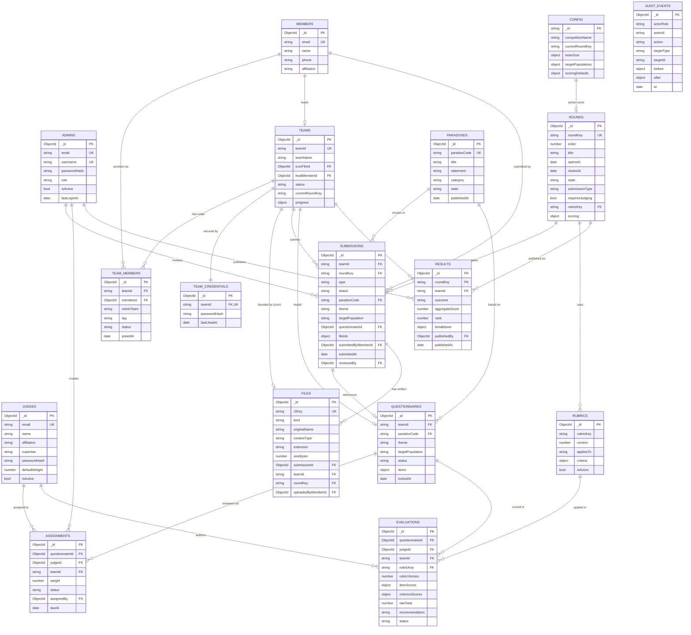

# Probably Paradoxical — ER Diagram

Standalone entity–relationship diagram for the data model in [`DB_DESIGN.md`](./DB_DESIGN.md).
Renders natively on GitHub (Mermaid). Crow's-foot notation: `||` = one, `o{` = zero-or-many, `o|` = zero-or-one.

## Legend

| Symbol | Meaning |
|--------|---------|
| `PK` | Primary key (`_id`, or stable code) |
| `FK` | Foreign reference (by `ObjectId` or stable code such as `teamId`, `paradoxCode`, `roundKey`) |
| `UK` | Unique key / unique index |
| `\|\|` | exactly one |
| `o{` | zero or many |
| `o\|` | zero or one |

## Reading the flow

1. **Setup** — host seeds `CONFIG`, `ROUNDS`, `PARADOXES`, `RUBRICS`; registers `TEAMS` (+ `TEAM_CREDENTIALS` + optional `team_icon` in R2) and `JUDGES`. People live in `MEMBERS`; the `TEAM_MEMBERS` mapper links each member to a team with a role.
2. **Stage 1** — each team creates one `SUBMISSIONS(type=theme)` referencing a `PARADOXES` choice + one `QUESTIONNAIRES`.
3. **Judging** — host creates `ASSIGNMENTS` (judge subsets); judges author `EVALUATIONS` against a `RUBRICS`.
4. **Gate** — host aggregates and writes `RESULTS` per round; `TEAMS.progress` is updated.
5. **Data & analysis** — teams add `SUBMISSIONS(type=dataset|analysis_zip)` with `FILES` in R2 (CSV/Excel, then ZIP).
6. **Throughout** — every state change is appended to `AUDIT_EVENTS`.
